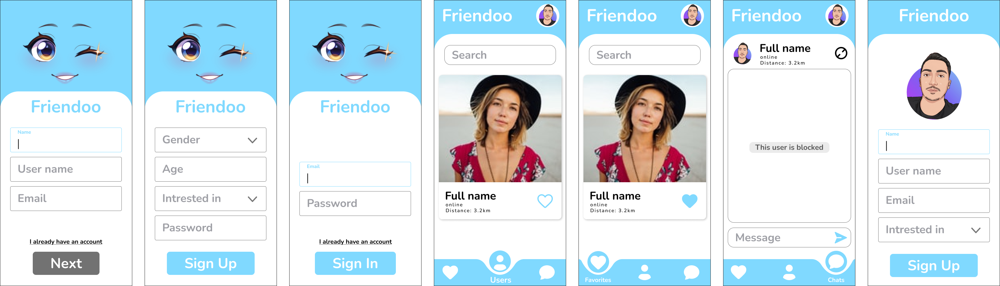

# Friendoo a dating application

⭐ Laravel, MySQL, and vanilla JavaScript application

You are asked to implement a dating website using Vanilla HTML, CSS, JS, and Laravel.

- On Signup, users choose their gender and which gender they are interested in. They also specify their location (Bonus: Get programarically the location of the user)
- Users can only surf people who are interested in.
- After logging in, users are displayed and sorted by their location.
- Users shall be able to upload a picture, bio, age, etc.
- Users shall be able to favorite others. Favorite users are displayed in a seperate page.
- Users shall be able to block others. Blocked users should not appear anywhere
- Users shall be able to chat with one another

📅 Deadline: Tuesday, October 4th, at 11:59 PM

---

## ✨TEAM Members

#### - Fullstack developer & Designer:

<a href='https://github.com/abdallahmoubarak'>Abdallah Moubarak

</a>

---

## 🎯 Project Process

#### Stage 1: creating ER diagram for the project

---

#### Stage 2: Creating Figma design

##### Components:

##### Mockup:

---

#### Stage 3: Creating List of API's needed for the project

---

#### Stage 4: Creating main branch, and master bransh for the project

repo link : https://github.com/abdallahmoubarak/friendoo-dating-app

- Substage 1 : developing frontend pages using (html - css- js)
- Substage 2 : implementing Laravel
- Substage 3 : listing APIs
- Substage 4 : fitting API's in frontend

###### repo graph

---

#### Stage 5: Project flow mini report

---

#### Stage 6: Presenting the project
